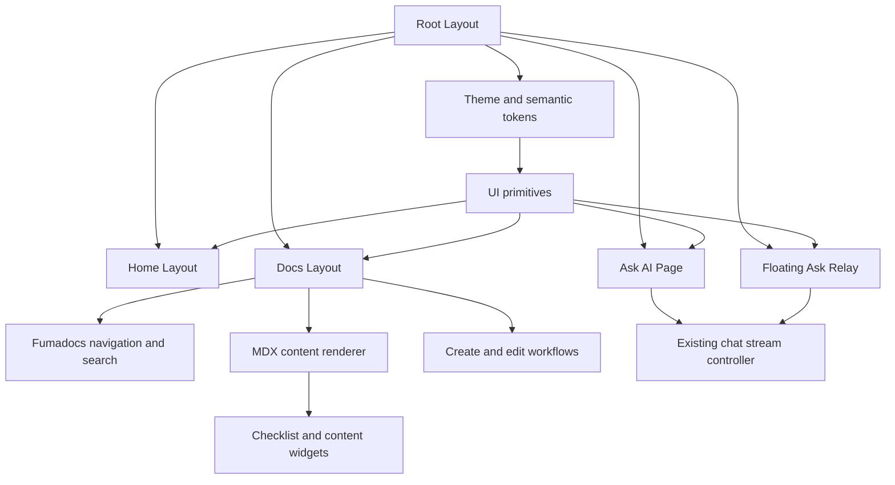
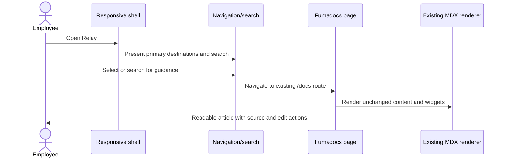
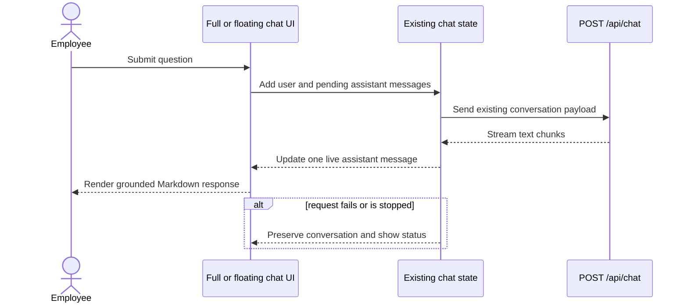
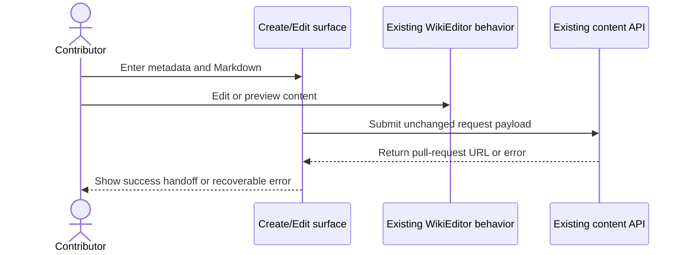

# Design Document: Polished UI Refresh

## Overview

`polished-ui-refresh` redesigns Relay as a distinctive employee field guide: editorial enough for long-form reading, energetic enough to feel welcoming, and structured like a dependable wayfinding system. The visual concept, **Relay Field Guide**, uses deep ink, warm paper, signal orange, cool informational accents, strong typographic hierarchy, route-line motifs, and restrained tactile motion.

This is a presentation-layer refresh. Existing routes, MDX content, Fumadocs page-tree generation and search, `/api/chat` streaming contract, local checklist persistence, and GitHub pull-request authoring workflows remain functionally unchanged. The design consolidates scattered one-off styles into semantic tokens and reusable React primitives, then applies them consistently to the home page, documentation shell, Ask AI surfaces, content forms, and responsive navigation.

The refresh must feel expressive without becoming noisy: orange marks action and momentum; ink establishes trust; paper surfaces support reading; sky, mint, and yellow distinguish content categories without changing semantics. Decoration never carries meaning by itself.

## Visual Direction: Relay Field Guide

### Design principles

1. **Wayfinding before decoration** — every page makes the next useful action obvious.
2. **Editorial confidence** — article content uses calm measure, generous rhythm, and visibly distinct headings, callouts, tables, and code.
3. **Signal, not confetti** — bold color appears at focal points rather than across every surface.
4. **One product, two AI modes** — full-page and floating Ask Relay share one visual and interaction grammar.
5. **Motion explains change** — transitions communicate hierarchy, streaming, expansion, and navigation; they do not run continuously.
6. **Accessible by construction** — semantic tokens, focus treatment, reduced-motion behavior, and touch targets are primitive-level contracts.

### Signature motifs

- A thin **relay line** with circular handoff nodes appears in the hero, section dividers, active navigation, and AI streaming state.
- Large editorial section numbers (`01`, `02`) and compact route labels create orientation without changing content.
- Surfaces use a clipped-corner accent or offset color edge sparingly; cards do not all share the same silhouette.
- Illustrative depth comes from layered solid colors, fine grid/route lines, and soft shadows—not glassmorphism or decorative gradient overload.

## Architecture


## Sequence Diagrams

### Core navigation and reading flow



### Ask Relay flow



### Content contribution flow



## Information Architecture and Responsive Shell

The global shell keeps the existing product map: Home, Handbook, New Page, Ask AI, theme controls, Fumadocs search, article navigation, table of contents, and floating assistant. The desktop composition is a stable top utility bar plus context-specific body; the mobile composition is a compact top bar with an off-canvas navigation sheet.

| Viewport | Home | Documentation | Ask AI |
|---|---|---|---|
| `< 640px` | Stacked hero, horizontal quick actions, one-column card stream | Compact header, off-canvas page tree, inline article actions, hidden TOC | Edge-to-edge conversation, sticky composer, suggestion list |
| `640–1023px` | Two-column bento grid | Collapsible sidebar, article-centered layout, optional TOC | Centered conversation with reduced gutters |
| `≥ 1024px` | Asymmetric hero and 12-column bento grid | Persistent sidebar, 65–75ch article, right TOC | Framed workspace with conversation rail |

Navigation state is exposed by text, icon, weight, and a relay-line marker—not color alone. Mobile drawers trap focus, close on `Escape`, restore focus to their trigger, and prevent background scrolling. Existing Fumadocs navigation and search behavior remain the source of truth; custom styling composes around supported layout hooks rather than duplicating routing state.
## Page Designs

### Home page

The hero becomes an asymmetric welcome panel rather than a centered logo stack. The left side carries the AFE label, a direct headline (“Start here. Find your next step.”), supporting copy, handbook/search action, and Ask Relay action. The right side uses the Relay mark inside a route-map composition with three handoff nodes: **Get oriented**, **Get equipped**, and **Get connected**. This creates a recognizable product image without adding stock photography.

Immediately below, the existing Day One checklist becomes a prominent “Your first handoff” progress surface. Category links use a bento layout with varied spans based on importance, but all nine existing destinations remain present and keyboard accessible. Each category receives a stable accent token and icon; accents never imply status. A final contribution strip links to FAQ, canonical sources, and New Page so discovery and stewardship feel part of one system.

### Documentation shell

- The sidebar uses grouped section labels from the existing page tree, a clear active-route rail, and stronger spacing between groups.
- Search becomes the dominant utility in the top bar, with a visible keyboard hint where supported.
- Article headers use a small section eyebrow, strong title, readable description, and a quiet metadata/action row.
- Prose is constrained to `65–75ch`; heading anchors, lists, tables, callouts, code, and Fumadocs cards receive explicit Field Guide treatments.
- The right table of contents uses a thin route line and moving active node. It disappears when space is insufficient rather than compressing the article.
- “Edit this page” remains after article content but moves into a clearly labeled contribution panel; the edit form and success handoff remain unchanged.
- New Page and edit surfaces share field, toolbar, status-banner, and action-row primitives while keeping current API requests and validation gates.

### Ask AI experience

The full-page experience is a focused “answer desk,” not a disconnected chatbot. The empty state combines a concise promise, three existing starter questions, and a visible trust note. In conversation mode, user prompts are compact ink bubbles while answers render as paper response sheets with an orange relay-node avatar, readable Markdown, and existing copy/download/reaction controls.

The composer is sticky within the page, supports Enter-to-send and Shift+Enter newline as today, exposes send/stop states, and never hides the preview disclaimer. Streaming uses a relay-line pulse and textual screen-reader status. The floating assistant uses the same `ChatMessage`, `PromptSuggestion`, `ChatComposer`, and trust-note styling at compact density; it keeps its current route suppression on `/ask-ai` and maximize/close actions.

### Navigation

- Desktop: logo at left, Handbook/search as primary discovery, contribution as a restrained secondary action, Ask AI as the signal action.
- Mobile: 44px minimum targets, logo and search always available, remaining actions in one labeled menu.
- Theme switching remains owned by Fumadocs/RootProvider and all custom assets respond to `.dark` without hydration flash.
- Active, hover, pressed, disabled, loading, expanded, and focus-visible states are specified for every interactive primitive.

## Design Tokens

Tokens are semantic CSS custom properties consumed by Tailwind utilities and Fumadocs aliases. Component code must not introduce raw brand hex values.

```typescript
type RelayTheme = {
  canvas: string;       // warm paper / deep night
  surface: string;      // primary reading surface
  surfaceRaised: string;
  ink: string;          // primary text
  inkMuted: string;
  border: string;
  brandInk: string;     // deep navy
  signal: string;       // action orange
  signalStrong: string;
  info: string;         // sky accent
  positive: string;     // mint accent
  highlight: string;    // yellow accent
  danger: string;
  focus: string;
};
```

Light foundation: canvas `#F7F3EA`, surface `#FFFCF6`, ink `#101B3D`, brand ink `#102A68`, signal `#E94F2D`. Dark foundation: canvas `#071226`, surface `#0D1B35`, ink `#F7F3EA`, signal `#FF7252`. Exact supporting shades may be tuned during contrast validation, but semantic roles and brand hierarchy are fixed. Fumadocs `--color-fd-*` variables map to these tokens so framework and custom surfaces stay coherent.

Spacing uses a 4px base; primary radii are 10px controls, 16px cards, and 24px feature panels. Shadows have only three levels (`rest`, `raised`, `overlay`) and pair with borders so hierarchy survives high-contrast and dark modes.
## Typography

- **Display/interface:** `Manrope` variable via `next/font`, with system sans fallback. It supplies distinctive open forms for headings, navigation, and controls.
- **Long-form body:** `Inter`, retained to avoid a readability regression and loading churn.
- **Code/metadata:** system monospace stack; no additional font request.

Display sizes use fluid `clamp()` values, but body text remains at least 16px for primary prose. Article line height is 1.7–1.8; UI text uses 1.35–1.5. Uppercase is limited to short eyebrows with increased tracking. No essential label relies on icon-only presentation unless it has an accessible name.

## Motion

| Interaction | Motion contract |
|---|---|
| Page/section entrance | 160–240ms fade + 6px rise, once, no cascade beyond 120ms |
| Card hover | 2px lift plus edge-color change; no scaling of text |
| Active navigation | Relay node slides along its rail in 180ms |
| Drawer/panel | 220ms transform with opacity scrim |
| Streaming | Subtle node pulse; no bouncing dots in the refreshed state |
| Progress completion | Existing confetti may run once after deliberate completion |

`prefers-reduced-motion: reduce` removes transforms, smooth scrolling, confetti, pulsing, and stagger while retaining immediate state changes. Motion never blocks input and no transition exceeds 300ms except the existing celebratory effect.

## Components and Interfaces

### Theme and layout primitives

```typescript
type SurfaceTone = 'canvas' | 'paper' | 'ink' | 'signal' | 'info' | 'positive' | 'highlight';
type Density = 'compact' | 'comfortable';

type PageFrameProps = {
  children: React.ReactNode;
  motif?: 'none' | 'route-map' | 'grid';
  className?: string;
};

type SectionHeadingProps = {
  eyebrow?: string;
  title: React.ReactNode;
  description?: React.ReactNode;
  action?: React.ReactNode;
  index?: string;
};

type StatusBannerProps = {
  tone: 'info' | 'success' | 'warning' | 'error';
  title?: string;
  children: React.ReactNode;
};
```

`PageFrame` owns canvas and decorative motifs with `aria-hidden` decoration. `SectionHeading` standardizes hierarchy across Home, Ask AI, and contribution pages. `StatusBanner` replaces ad hoc green/red text while preserving current status state machines.

### Interactive primitives

```typescript
type ButtonVariant = 'signal' | 'ink' | 'outline' | 'ghost' | 'danger';
type ButtonSize = 'sm' | 'md' | 'lg' | 'icon';
type CardVariant = 'plain' | 'interactive' | 'feature' | 'inset';

type FieldProps = {
  id: string;
  label: string;
  hint?: string;
  error?: string;
  required?: boolean;
  children: React.ReactElement;
};

type IconActionProps = React.ButtonHTMLAttributes<HTMLButtonElement> & {
  label: string;
  size?: 'sm' | 'md';
};
```

Buttons and links may share variant classes but retain native semantics. `Field` wires label, hint, error, `aria-describedby`, and invalid state. `IconAction` requires a non-empty accessible label. Existing `Button`, `Card`, and `Badge` exports evolve compatibly so current call sites can migrate incrementally.
### Navigation and cards

```typescript
type NavAction = {
  label: string;
  href: string;
  icon?: React.ComponentType<{ className?: string }>;
  emphasis: 'primary' | 'secondary' | 'utility';
};

type CategoryCardProps = {
  title: string;
  description: string;
  href: string;
  icon: React.ComponentType<{ className?: string }>;
  accent: Exclude<SurfaceTone, 'canvas' | 'paper' | 'ink' | 'signal'>;
  span?: 'standard' | 'wide' | 'tall';
};
```

`CategoryCard` renders one semantic link with a visible heading and description; it does not nest controls. The data layer extends the existing category array only with visual metadata (`accent`, `span`), leaving titles and destinations intact.

### Shared AI presentation

```typescript
type ChatMessage = {
  id: string;
  role: 'user' | 'assistant';
  content: string;
};

type ChatMessageProps = {
  message: ChatMessage;
  streaming?: boolean;
  density?: Density;
  actions?: React.ReactNode;
};

type ChatComposerProps = {
  value: string;
  onChange(value: string): void;
  onSubmit(): void;
  onStop?(): void;
  streaming: boolean;
  autoFocus?: boolean;
  compact?: boolean;
};

type PromptSuggestionProps = {
  children: string;
  onSelect(prompt: string): void;
  compact?: boolean;
};
```

The full and floating experiences share presentation only. Their existing state ownership and fetch behavior can remain separate initially, reducing regression risk. Assistant Markdown rendering remains `react-markdown` with `remark-gfm`; external links keep safe `target`/`rel` behavior and content links remain visually recognizable.

## Data Models

No persistent or API data model changes are required. Existing `Message`, checklist state, category destinations, MDX frontmatter, content create/edit payloads, and chat payloads stay structurally compatible.

```typescript
type VisualCategory = {
  title: string;
  description: string;
  href: `/docs/${string}`;
  icon: React.ComponentType<{ className?: string }>;
  accent: 'info' | 'positive' | 'highlight';
  span: 'standard' | 'wide' | 'tall';
};

type ResponsiveState = {
  mobileNavigationOpen: boolean;
  assistantPanelOpen: boolean;
};
```

Validation rules:
- Every destination has non-empty visible text and a valid internal route.
- Decorative accent values are from a finite token set.
- Only one modal-style overlay owns focus at a time.
- Chat content and authoring payloads are never transformed by visual primitives.

## Key Functions with Formal Specifications

### `resolveResponsiveLayout`

```typescript
function resolveResponsiveLayout(width: number): 'mobile' | 'tablet' | 'desktop';
```

**Preconditions:** `width` is finite and `width >= 0`.

**Postconditions:** returns `mobile` iff `width < 640`; `tablet` iff `640 <= width < 1024`; otherwise `desktop`. The result depends only on `width`.

**Loop invariants:** N/A.
### `mapThemeToFumadocs`

```typescript
function mapThemeToFumadocs(theme: RelayTheme): Record<`--color-fd-${string}`, string>;
```

**Preconditions:** every `RelayTheme` role is a valid CSS color and required foreground/background pairs have been contrast-tested.

**Postconditions:** returns all Fumadocs aliases consumed by the application; preserves semantic role equivalence; does not mutate `theme`.

**Loop invariants:** while mapping entries, all previously mapped aliases continue to reference the corresponding semantic role.

### `handleComposerKeyDown`

```typescript
function handleComposerKeyDown(
  event: React.KeyboardEvent<HTMLTextAreaElement>,
  canSubmit: boolean,
  submit: () => void,
): void;
```

**Preconditions:** `submit` is stable for the current render.

**Postconditions:** plain Enter prevents a newline and invokes `submit` exactly once iff `canSubmit`; Shift+Enter preserves native newline behavior; every other key preserves native behavior.

**Loop invariants:** N/A.

### `deriveFieldA11y`

```typescript
function deriveFieldA11y(input: {
  id: string;
  hasHint: boolean;
  error?: string;
}): {
  'aria-describedby'?: string;
  'aria-invalid': boolean;
};
```

**Preconditions:** `id` is unique and non-empty.

**Postconditions:** `aria-invalid` is true iff a non-empty error exists; `aria-describedby` names every rendered hint/error element and no absent element.

**Loop invariants:** N/A.

### `getMotionPolicy`

```typescript
function getMotionPolicy(prefersReducedMotion: boolean): {
  animateTransforms: boolean;
  smoothScroll: boolean;
  celebrate: boolean;
};
```

**Preconditions:** none.

**Postconditions:** all three outputs are false when reduced motion is preferred; otherwise all are permitted, subject to component state. The function has no side effects.

**Loop invariants:** N/A.

## Algorithmic Workflow

```typescript
function presentRoute(route: string, viewportWidth: number, theme: 'light' | 'dark') {
  const layout = resolveResponsiveLayout(viewportWidth);
  const tokens = theme === 'dark' ? darkRelayTheme : lightRelayTheme;
  applyThemeAliases(mapThemeToFumadocs(tokens));

  if (route === '/ask-ai') {
    return renderAskAiWorkspace({ layout, showFloatingAssistant: false });
  }
  if (route.startsWith('/docs')) {
    return renderDocsShell({ layout, preserveFumadocsTree: true });
  }
  return renderHome({ layout, preserveCategoryDestinations: true });
}
```

**Preconditions:** route is an application pathname; viewport width and theme are valid.

**Postconditions:** one page family renders; the floating assistant is absent on `/ask-ai`; routing/content sources are not modified.

**Loop invariants:** when category or navigation collections are rendered, all previously emitted items retain unique keys, valid destinations, and accessible names.
## Example Usage

```tsx
<PageFrame motif="route-map">
  <SectionHeading
    eyebrow="Amazon Future Engineers"
    title="Start here. Find your next step."
    description="Your field guide to onboarding, benefits, growth, and community."
    action={<Link className={buttonVariants({ variant: 'signal', size: 'lg' })} href="/docs">Explore the handbook</Link>}
  />
  <Card variant="feature"><DayOneChecklist variant="widget" /></Card>
</PageFrame>
```

```tsx
<Field id="create-title" label="Page title" required error={errors.title}>
  <input value={title} onChange={handleTitleChange} />
</Field>
<StatusBanner tone="info">A maintainer will review this pull request before publishing.</StatusBanner>
```

```tsx
<ChatMessageView message={message} streaming={streamingMessageId === message.id}>
  <MessageActions message={message} />
</ChatMessageView>
<ChatComposer value={input} onChange={setInput} onSubmit={submit} onStop={stop} streaming={isStreaming} />
```

## Correctness Properties

### Property 1: Route preservation
For every existing navigation item `n`, refreshed navigation resolves `n.href` to the same pathname as before the refresh.

**Validates: Requirements 2.1, 10.1**

### Property 2: Content preservation
For every valid MDX page `p`, the refreshed documentation shell renders the same `p.data.body`, title, description, and table-of-contents input.

**Validates: Requirements 4.1, 4.2**

### Property 3: Chat contract preservation
For every conversation `c`, submitting `c` emits the same `/api/chat` method, headers, and `{ role, content }` sequence; presentation state adds no payload fields.

**Validates: Requirements 5.3, 10.2**

### Property 4: Authoring contract preservation
For every valid create/edit form state `f`, refreshed submission serializes the same slug, title, optional description, and Markdown content to the same endpoint.

**Validates: Requirements 7.2, 7.4, 10.2**

### Property 5: Responsive completeness
For every finite viewport width `w >= 0`, exactly one responsive layout state is selected and all primary routes remain reachable.

**Validates: Requirements 2.3, 2.4, 8.6**

### Property 6: Keyboard equivalence
For every enabled interactive action reachable by pointer, an equivalent keyboard activation exists with visible focus.

**Validates: Requirements 8.3**

### Property 7: Contrast invariant
For every theme and semantic text/background token pair, normal text contrast is at least 4.5:1 and large text/non-text UI contrast is at least 3:1.

**Validates: Requirements 8.2**

### Property 8: Reduced-motion invariant
For every component motion `m`, when reduced motion is requested, `m` performs no non-essential transform, smooth scroll, pulse, stagger, or celebration.

**Validates: Requirements 9.3**

### Property 9: Accessible field linkage
For every rendered field, its label targets exactly one control; every rendered hint/error is referenced by that control.

**Validates: Requirements 6.5**

### Property 10: Overlay focus containment
For every open modal navigation or assistant overlay, focus remains inside until dismissal and returns to the opening control afterward.

**Validates: Requirements 2.5**

### Property 11: Theme parity
For every meaningful visual state available in light mode, dark mode provides an equivalent distinguishable state without depending on color alone.

**Validates: Requirements 1.6**

### Property 12: Single-assistant invariant
For every route equal to `/ask-ai`, the floating assistant trigger and panel are not rendered.

**Validates: Requirements 5.8**

## Error Handling

| Scenario | Response | Recovery |
|---|---|---|
| Chat request fails | Render error as assistant status with live-region announcement | Keep prompt history and composer available for retry |
| Chat is stopped | Preserve received content or show existing stopped status | Allow next prompt immediately |
| Raw page load fails | Show `StatusBanner` in edit surface | Allow close and later retry; do not alter article |
| Create/edit submission fails | Associate error summary with form status | Preserve all entered fields and Markdown |
| Logo/image unavailable | Keep adjacent/accessible product name | Navigation remains operable |
| Theme preference unavailable | Use light semantic token defaults | Respect subsequent provider update |
| JavaScript hydration pending | Render stable server layout without hidden core navigation | Enhance motion and overlays after hydration |

Errors are expressed with icon, title/text, and semantic attributes—not red alone. Existing backend messages may be displayed, but visual components must not expose secrets or add raw response data.
## Accessibility

Target WCAG 2.2 AA across light and dark themes.

- Preserve semantic landmarks, heading order, native buttons/links, and list structures.
- Use `:focus-visible` with a high-contrast 2px ring and offset; never remove focus without replacement.
- Maintain 44×44px touch targets for primary mobile controls and at least 24×24px for compact desktop icon actions with adequate spacing.
- Announce chat streaming/status changes politely without announcing every token; expose a stable “generating response” status.
- Drawers and overlays receive names, focus trapping, Escape dismissal, and trigger focus restoration.
- Inputs expose labels, requirements, hints, errors, disabled/loading state, and submit outcomes.
- Do not place meaningful text in background images or route-line decoration.
- Retain browser zoom and text reflow through 400%; avoid fixed heights for content areas except bounded overlays with internal scrolling.
- Use `prefers-reduced-motion`, `prefers-contrast`, and forced-color-friendly borders/focus where supported.

## Testing Strategy

### Unit and property-based tests

Use the existing React/TypeScript test direction when a runner is introduced; use `fast-check` for pure token/layout properties. No new runtime dependency is required by the design itself.

- Token-to-Fumadocs alias mapping is total and deterministic.
- Breakpoint resolution satisfies responsive completeness for arbitrary non-negative widths.
- Field ARIA linkage is correct across hint/error combinations.
- Keyboard composer behavior distinguishes Enter, Shift+Enter, disabled, empty, and streaming states.
- Motion policy disables every non-essential motion flag under reduced motion.
- Category visual metadata never changes route destinations.

### Component and accessibility tests

- Render Home, docs shell, Ask AI empty/conversation/stream/error states, floating panel, New Page, edit form, and checklist in both themes.
- Verify tab order, accessible names, heading hierarchy, live regions, overlay focus, and escape behavior.
- Run automated accessibility checks, then manually test keyboard-only use, 200%/400% zoom, reduced motion, and Windows high-contrast mode.
- Confirm full and floating chat retain send, stop where available, maximize, close, copy, download, and reaction behavior.

### Visual regression

Capture stable screenshots at 375×812, 768×1024, 1280×800, and 1536×960 in light/dark themes. Cover Home, long documentation, table/code-heavy documentation, Ask AI empty, Ask AI conversation, floating assistant, create, and edit states. Disable non-deterministic animation for captures.

### Integration and smoke tests

- Navigate every existing top-level category and sidebar group.
- Search and open a result through Fumadocs.
- Stream a mocked chat response and recover from a mocked failure.
- Toggle/check Day One items and reload to confirm persistence.
- Submit mocked create/edit requests and confirm unchanged payloads and pull-request success links.
- Verify the floating assistant is absent only on `/ask-ai`.

## Performance Considerations

- Keep the refresh CSS-first; do not add an animation library or client-side layout observer for behavior CSS can express.
- Load at most one new variable font and retain Inter; use `next/font` subsetting and font-display behavior.
- Route-map and grid motifs are CSS/SVG decoration, not large raster media.
- Preserve server rendering for Home and docs; only existing interactive islands and required overlays are client components.
- Avoid `backdrop-filter` as a foundational effect; overlays must remain legible without it.
- Target no material regression to Core Web Vitals: CLS ≤ 0.1, LCP ≤ 2.5s at p75, INP ≤ 200ms at p75.
- Virtualization is unnecessary for current navigation/message volume; preserve simple DOM until measured data warrants complexity.

## Security and Privacy Considerations

The refresh adds no new data collection, persistence, external service, or authorization path. User questions, handbook content, and authoring submissions continue through existing endpoints only. External links retain `rel="noopener noreferrer"`; rendered AI Markdown remains React-rendered rather than injected HTML. Decorative/UI primitives must not log message text or form content. The existing product disclaimer and canonical-source guidance remain visible and are not weakened by visual hierarchy.

## Dependencies

Existing dependencies remain sufficient: Next.js 16, React 19, Tailwind CSS 4, Fumadocs UI, `class-variance-authority`, Lucide React, `react-markdown`, and `remark-gfm`. `next/font` supplies typography without a new package. No animation, component-system, CSS-in-JS, analytics, or state-management dependency is proposed.

## Implementation Boundaries and File Map

| Area | Primary files | Intended change |
|---|---|---|
| Theme/tokens/type | `src/app/global.css`, `src/app/layout.tsx` | Semantic palette, typography, global accessibility and motion rules |
| Reusable primitives | `src/components/ui/*` plus focused new primitives | Variants, fields, status, section and AI presentation |
| Global navigation | `src/lib/layout.shared.tsx`, home/docs layouts | Visual hierarchy and responsive actions using existing Fumadocs contracts |
| Home | `src/app/(home)/page.tsx` | Asymmetric hero, bento categories, checklist and contribution strip |
| Docs | docs layout/page, `src/components/mdx.tsx` | Shell/prose/action styling without content-source changes |
| Ask AI | `ask-ai-chat.tsx`, `floating-chat.tsx` | Shared presentation and accessible states; unchanged API contract |
| Authoring | create/edit/editor components | Shared fields, status, toolbar and responsive layout; unchanged requests |
| Product widgets | checklist, bucket list, hikes | Align surfaces and tokens; preserve state/content behavior |

## Rollout

Implement foundation and primitives first, then migrate shell, Home, docs/MDX, Ask AI, and authoring surfaces. Keep each route functional throughout. Finalize only after responsive, light/dark, accessibility, visual-regression, type, lint, and production build checks pass. No content migration or backend deployment is required.
