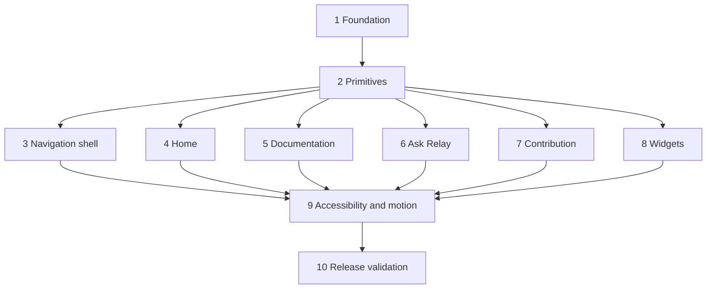

# Implementation Plan

## Overview

Implement the Relay Field Guide refresh incrementally: establish tokens and primitives first, then migrate shell and page surfaces, and finish with cross-cutting accessibility, regression, and release gates. Every phase preserves existing routes, content sources, endpoint contracts, and interaction state.

## Tasks

- [ ] 1. Establish the Field Guide visual foundation
  - [ ] 1.1 Define semantic light/dark tokens and map them to Fumadocs aliases in `global.css`
    - Add canvas, surface, ink, signal, accent, status, border, focus, elevation, radius, and spacing roles.
    - Remove component dependence on raw brand hex values while retaining compatible `fd-*` utilities.
    - Add selection, focus-visible, forced-colors, and high-contrast base behavior.
    - _Requirements: 1.1, 1.2, 1.3, 1.5, 8.2, 9.6_
  - [ ] 1.2 Configure Manrope display typography while retaining Inter body and system monospace stacks
    - Apply font variables without hydration flash or content layout shift.
    - Define fluid display sizes and readable prose rhythm.
    - _Requirements: 1.4, 1.6, 4.3, 10.6_
  - [ ] 1.3 Write property tests for theme alias completeness and semantic contrast
    - Generate complete theme values and verify deterministic Fumadocs mappings.
    - Verify every required foreground/background pair meets its WCAG ratio in light and dark themes.
    - **PBT: Properties 7 and 11**
    - _Requirements: 1.1, 1.2, 1.6, 8.2_

- [ ] 2. Build accessible reusable primitives
  - [ ] 2.1 Extend Button, Card, and Badge with compatible Field Guide variants
    - Add signal, ink, outline, ghost, danger, plain, interactive, feature, and inset roles as applicable.
    - Preserve native button/link semantics and existing call-site compatibility.
    - _Requirements: 6.1, 6.2, 6.3, 6.6, 6.7_
  - [ ] 2.2 Add PageFrame, SectionHeading, Field, IconAction, and StatusBanner primitives
    - Centralize motif semantics, heading hierarchy, accessible field linkage, icon labels, and status roles.
    - Ensure decoration is hidden from assistive technology.
    - _Requirements: 3.2, 6.1, 6.4, 6.5, 7.7, 8.5, 8.7_
  - [ ] 2.3 Write property tests for primitive semantics and field linkage
    - Generate primitive variants and state combinations to verify native roles and accessible names.
    - Generate hint/error combinations to verify labels, descriptions, and invalid state.
    - **PBT: Properties 6 and 9**
    - _Requirements: 6.2, 6.3, 6.4, 6.5, 8.3_

- [ ] 3. Refresh the global and documentation navigation shell
  - [ ] 3.1 Restyle shared Fumadocs layout options and primary actions
    - Establish desktop hierarchy for logo, search/handbook discovery, contribution, Ask AI, and theme controls.
    - Preserve the existing page tree, routes, search integration, and theme provider.
    - _Requirements: 2.1, 2.2, 2.6, 10.1, 10.2_
  - [ ] 3.2 Implement responsive navigation behavior and active route treatment
    - Provide persistent desktop navigation and compact/off-canvas behavior at narrower widths.
    - Add focus containment, Escape dismissal, background locking, and focus restoration where custom overlays are needed.
    - _Requirements: 2.3, 2.4, 2.5, 8.3, 8.4, 8.6_
  - [ ] 3.3 Test route reachability, breakpoint completeness, and overlay keyboard behavior
    - Compare all primary destinations against the current baseline route set.
    - Exercise 639/640 and 1023/1024 boundaries plus keyboard-only overlay sequences.
    - **PBT: Properties 1, 5, and 10**
    - _Requirements: 2.1, 2.3, 2.4, 2.5, 10.1_
- [ ] 4. Recompose the home page as the Relay Field Guide
  - [ ] 4.1 Build the asymmetric hero and route-map illustration
    - Present the AFE label, welcome message, Handbook action, Ask Relay action, and three orientation nodes.
    - Keep illustrative content decorative and CSS/SVG based.
    - _Requirements: 3.1, 3.2, 10.8_
  - [ ] 4.2 Build the responsive category bento and contribution strip
    - Preserve all nine category labels, descriptions, icons, and destinations while adding finite accent/span metadata.
    - Add visible FAQ, Canonical Sources, and New Page paths.
    - _Requirements: 3.4, 3.5, 3.6, 8.4_
  - [ ] 4.3 Promote the Day One checklist without altering behavior
    - Apply the feature-surface treatment and responsive layout.
    - Preserve items, storage key, completion count, reload behavior, and celebration trigger.
    - _Requirements: 3.3, 9.3, 9.4, 10.2_
  - [ ] 4.4 Test home content, route, and checklist preservation
    - Compare rendered category destinations to baseline data.
    - Generate checklist toggle sequences and verify persistence/completion in both motion modes.
    - _Requirements: 3.3, 3.4, 3.6, 9.4, 10.1_

- [ ] 5. Refresh documentation reading and MDX presentation
  - [ ] 5.1 Apply the Field Guide layout to docs sidebar, article header, prose, and table of contents
    - Preserve Fumadocs group ordering, search, title, description, body, and TOC inputs.
    - Add route-line active treatment and remove/relocate the TOC when space is constrained.
    - _Requirements: 4.1, 4.2, 4.3, 4.5, 4.6_
  - [ ] 5.2 Style all supported MDX content forms and widgets
    - Cover headings, anchors, lists, tables, blockquotes, callouts, cards, inline code, code blocks, and custom widgets in both themes.
    - Retain relative links and all registered MDX components.
    - _Requirements: 4.2, 4.4, 8.2, 8.5_
  - [ ] 5.3 Reframe the Edit Page entry point as an article contribution panel
    - Keep the action after content and retain its existing load/edit behavior.
    - _Requirements: 4.7, 7.3_
  - [ ] 5.4 Test documentation content equivalence and responsive reading states
    - Render representative, long, table-heavy, code-heavy, and widget-heavy MDX pages.
    - Compare title, description, links, widgets, tree, and TOC inputs to baseline fixtures.
    - **PBT: Property 2**
    - _Requirements: 4.1, 4.2, 4.3, 4.4, 4.6_

- [ ] 6. Unify full-page and floating Ask Relay presentation
  - [ ] 6.1 Extract shared ChatMessage, PromptSuggestion, ChatComposer, and trust-note presentation
    - Support comfortable and compact densities without centralizing existing state controllers prematurely.
    - Render assistant Markdown and external links through the existing safe pipeline.
    - _Requirements: 5.2, 10.4, 10.5_
  - [ ] 6.2 Refresh the full Ask AI empty, conversation, streaming, stopped, and error states
    - Preserve starter prompts, send/stop behavior, copy, download, reactions, and disclaimer.
    - Replace bouncing dots with accessible relay-line streaming feedback.
    - _Requirements: 5.1, 5.4, 5.5, 5.6, 5.7, 9.5_
  - [ ] 6.3 Refresh the floating panel and trigger
    - Preserve open, close, maximize, suggestions, submit, error recovery, auto-focus, and route suppression.
    - Ensure mobile sizing, focus order, and content scrolling remain usable.
    - _Requirements: 5.8, 5.9, 8.4, 8.6_
  - [ ] 6.4 Write property tests for chat contracts, streaming, keyboard handling, and route suppression
    - Generate valid conversations and assert exact endpoint, method, headers, payload ordering, and chunk concatenation.
    - Generate key/modifier/state combinations and route values to verify composer semantics and floating-assistant presence.
    - **PBT: Properties 3 and 12**
    - _Requirements: 5.3, 5.4, 5.5, 5.8, 10.2_

- [ ] 7. Polish contribution and Markdown editing surfaces
  - [ ] 7.1 Migrate New Page and Edit Page forms to shared fields, actions, and status banners
    - Preserve current validation gates, pending state, errors, success copy, and pull-request links.
    - Keep entered content intact after failed requests.
    - _Requirements: 7.2, 7.3, 7.4, 7.6, 7.7, 7.8_
  - [ ] 7.2 Refresh WikiEditor toolbar, mode switch, textarea, and preview
    - Preserve every formatting action, selection/cursor behavior, edit/preview state, callback, and Markdown content.
    - Make toolbar wrapping and editor sizing usable on mobile and at 400% zoom.
    - _Requirements: 7.5, 8.6_
  - [ ] 7.3 Write property tests for slug, payload, selection, and failure preservation
    - Generate titles/manual slug edits and assert current slug transformation rules.
    - Generate valid forms and assert exact create/edit payloads and endpoint paths.
    - Generate toolbar selections and failed requests and assert transformed/preserved content.
    - **PBT: Property 4**
    - _Requirements: 7.1, 7.2, 7.4, 7.5, 7.7, 10.2_

- [ ] 8. Align remaining product widgets with the visual system
  - [ ] 8.1 Migrate checklist internals, Seattle hikes, and bucket list to semantic primitives and tokens
    - Preserve their content, control behavior, persistence, and MDX registration.
    - _Requirements: 1.3, 1.5, 4.2, 10.2_
  - [ ] 8.2 Verify widget keyboard, theme, zoom, and narrow-layout behavior
    - Confirm states remain visible without color and wide content scrolls only where intrinsic.
    - _Requirements: 1.6, 8.3, 8.6, 8.7_

- [ ] 9. Apply motion, accessibility, and responsive safeguards
  - [ ] 9.1 Add a finite motion inventory and reduced-motion overrides
    - Keep standard transitions at or below 300ms and limit them to explanatory state changes.
    - Disable transforms, smooth scroll, pulse, stagger, and celebration under reduced motion.
    - _Requirements: 9.1, 9.2, 9.3, 9.4, 9.5_
  - [ ] 9.2 Write property tests for reduced-motion and duration invariants
    - Enumerate motion classes/components and assert reduced behavior and maximum standard duration.
    - **PBT: Property 8**
    - _Requirements: 9.1, 9.3, 9.5_
  - [ ] 9.3 Run automated and manual accessibility verification
    - Cover landmarks, headings, names, tab order, focus, overlays, live regions, contrast, 400% zoom, 320px reflow, reduced motion, and forced colors.
    - Fix violations in primitives before applying page-level exceptions.
    - _Requirements: 8.1, 8.2, 8.3, 8.4, 8.5, 8.6, 8.7, 8.8, 9.6_

- [ ] 10. Validate visual quality, compatibility, and release readiness
  - [ ] 10.1 Add responsive light/dark visual regression coverage
    - Capture Home, docs variants, Ask AI states, floating assistant, New Page, and Edit Page at 375, 768, 1280, and 1536 widths.
    - Disable non-deterministic motion during capture.
    - _Requirements: 1.6, 3.5, 4.4, 5.1, 8.6_
  - [ ] 10.2 Run targeted end-to-end workflow smoke tests
    - Cover navigation/search, every category, checklist reload, mocked chat stream/failure, and mocked create/edit success/failure.
    - _Requirements: 2.1, 3.3, 4.1, 5.3, 5.9, 7.6, 7.7, 7.8, 10.2_
  - [ ] 10.3 Verify dependency, privacy, rendering, and asset boundaries
    - Confirm no analytics, external services, new persistence/auth paths, runtime animation library, sensitive presentation logging, or large decorative raster assets were added.
    - Confirm Home/docs retain server-rendered essential content.
    - _Requirements: 8.8, 10.3, 10.4, 10.5, 10.7, 10.8_
  - [ ] 10.4 Run final type, lint, build, accessibility, visual, and performance gates
    - Run `npm run types:check`, `npm run lint`, and `npm run build` after targeted tests.
    - Measure CLS, LCP, and INP against the specified targets and document any environment limitations.
    - _Requirements: 10.6, 10.9_

## Task Dependency Graph

```json
{
  "waves": [
    { "wave": 1, "tasks": ["1"] },
    { "wave": 2, "tasks": ["2"] },
    { "wave": 3, "tasks": ["3", "4", "5", "6", "7", "8"] },
    { "wave": 4, "tasks": ["9"] },
    { "wave": 5, "tasks": ["10"] }
  ]
}
```



Tasks 3–8 can proceed in parallel after the primitives are stable. Their property tests should land with the behavior they protect, not be deferred to final validation.

## Notes

- This plan does not authorize implementation yet; it defines the future execution order.
- PBT labels identify property-based test tasks and map back to the design correctness properties.
- Do not add runtime dependencies unless a later implementation decision explicitly revises the design.
- Preserve existing content, routes, endpoints, storage semantics, and Fumadocs ownership throughout migration.
